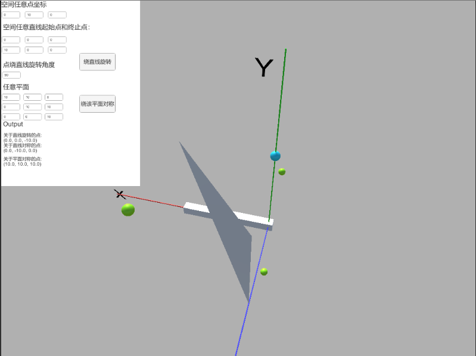

### 高级计算机图形学Assignment1

###### 要求：

1.空间中任意一点绕空间中任意一条直线旋转后的坐标位置

2.空间中任意一点绕空间中任意一条直线对称后的坐标位置

3.空间中任意一点绕空间中任意一个平面对称后的坐标位置

###### 项目实现

* Unity版本：Unity 2018.2.0.b1
* 编程语言：C#
* 目标平台：Windows

###### 操作指南

* 打开可执行文件夹内的Assignment1.exe文件
* 选择分辨率（推荐1280 x 720），进入演示系统
* 在输入框内输入空间任一点坐标(Px,Py,Pz)
* 在输入框内输入空间中任一条直线的起始点坐标：(SPx,SPy,SPz)和(EPx,EPy,EPz)
* 在输入框内输入要旋转的角度Angle
* 单击旋转按钮，生成绕特定直线旋转Angle后的特定点1，关于这个直线对称的特定点2
* 在输入框内输入空间任意三个不共线顶点坐标:(PP1x,PP1y,PP1z), (PP2x,PP2y,PP2z)和(PP3x,PP3y,PP3z)
* 单击按平面对称按钮，生成对称平面点，原始坐标点为蓝色点，其他点为绿色点，如下图演示
* 在视图内，使用鼠标左键进行视角移动，鼠标右键进行旋转观察

###### 程序截图

###### 参考文献

* 三维空间画线

  <https://blog.csdn.net/orbit/article/details/7185982> 

		<http://citeseerx.ist.psu.edu/viewdoc/download?doi=10.1.1.845.6869&rep=rep1&type=pdf> 

* 三维坐标旋转

  <https://jermmy.xyz/2017/03/28/2017-3-28-rotate-in-3D/> 

* 三维点平面对称

  <https://blog.csdn.net/yinhun2012/article/details/83788822> 

